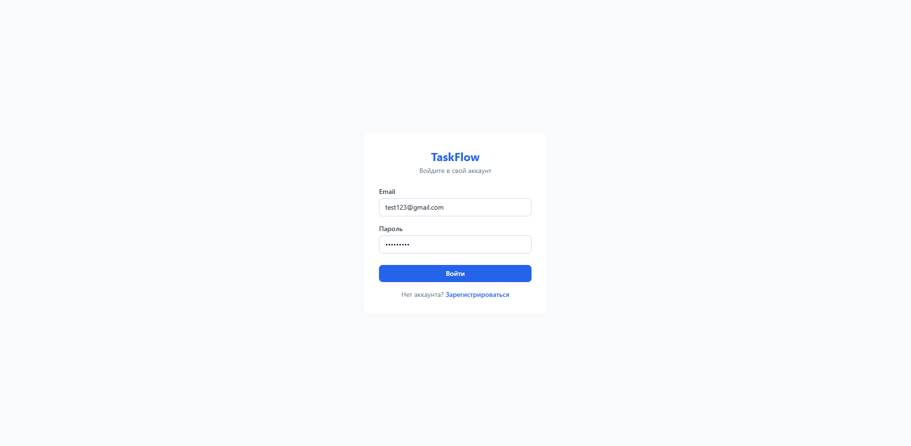
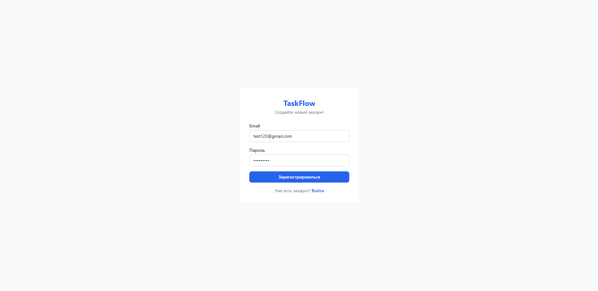
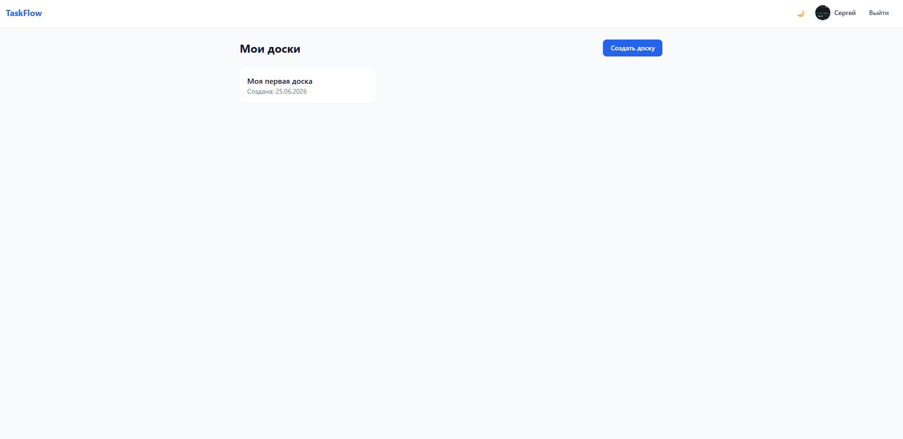
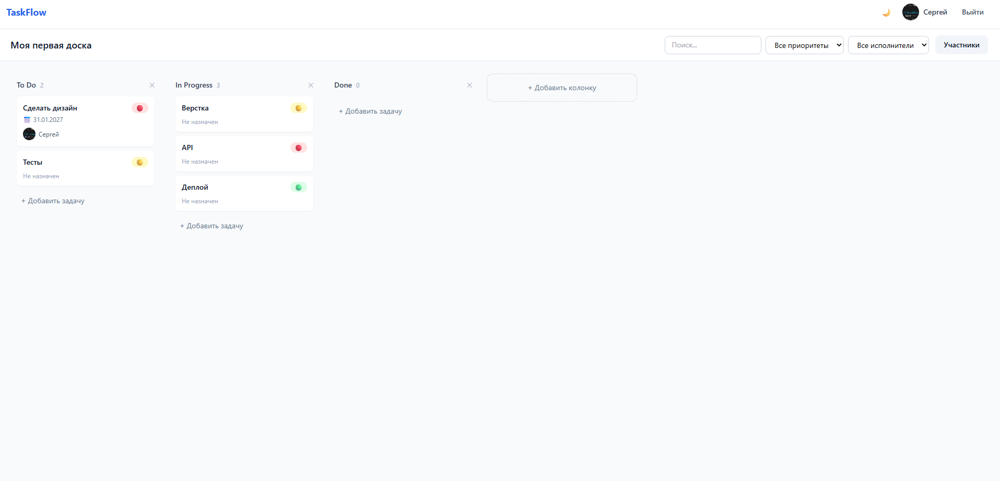
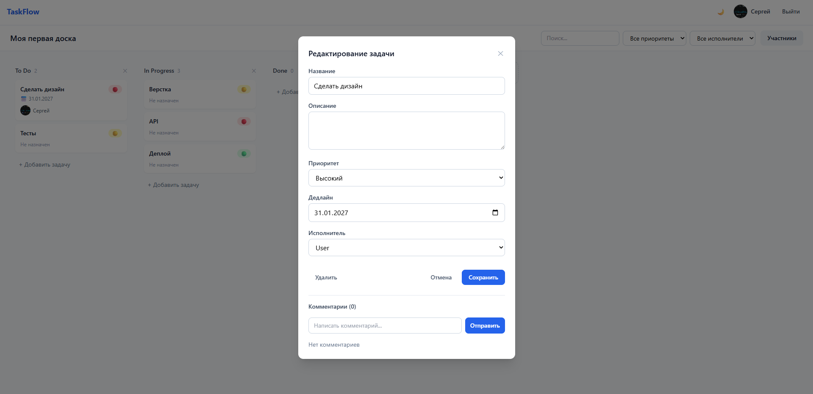
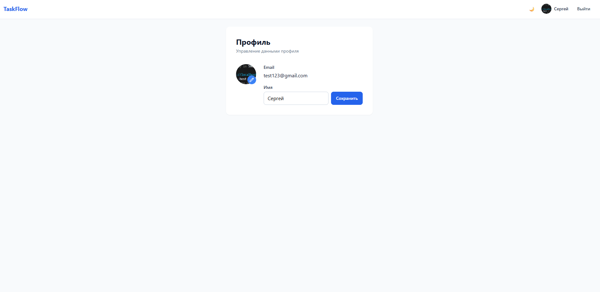
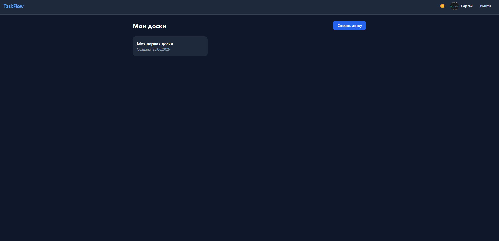

# 🚀 TaskFlow - Jira Lite

**TaskFlow** — это веб-приложение для управления задачами с использованием канбан-досок и поддержкой реального времени (Realtime).

---

## 📸 Скриншоты

| Страница входа | Страница регистрации |
|----------------|---------------------|
|  |  |

| Главная страница | Страница доски |
|------------------|----------------|
|  |  |

| Модальное окно задачи | Страница профиля |
|----------------------|------------------|
|  |  |

| Тёмная тема |
|-------------|
|  |

---

## 🎯 Функционал

### Уровень 1 (MVP) - ✅
- [x] Регистрация и вход по email + пароль
- [x] Защита маршрутов (редирект на /login)
- [x] Создание, просмотр и удаление досок
- [x] Колонки: To Do, In Progress, Done (создаются автоматически)
- [x] Добавление, удаление и переименование колонок
- [x] Создание и удаление задач
- [x] Drag-and-drop между колонками и внутри колонки
- [x] Адаптивная вёрстка (desktop + mobile)
- [x] Лоадеры (спиннеры)
- [x] Обработка ошибок (уведомления)

### Уровень 2 (Полный функционал) - ✅
- [x] Детали задачи в модальном окне
- [x] Поля: название, описание, приоритет, дедлайн
- [x] Назначение исполнителя (выбор из участников доски)
- [x] Комментарии: список, добавление, удаление
- [x] Realtime обновления (изменения синхронизируются у всех участников)
- [x] Приглашение пользователей на доску по email
- [x] Роли: owner (полный доступ) и member (редактирование задач)
- [x] Профиль пользователя: имя, аватар
- [x] Отображение аватара в карточках задач и комментариях

### Бонусы - ⭐
- [x] Тёмная тема (переключатель)
- [ ] Фильтрация задач (по приоритету, исполнителю)
- [ ] Поиск задач по названию
- [ ] Google OAuth

---

## 🛠️ Стек технологий

| Категория | Технология |
|-----------|------------|
| Фреймворк | React 18+ (Vite) |
| Язык | TypeScript |
| Backend / БД | Supabase (Postgres, Auth, Realtime, Storage) |
| Стилизация | Tailwind CSS |
| Drag & Drop | @dnd-kit/core |
| Роутинг | React Router v6 |
| State management | React Query + Context API |
| Уведомления | React Hot Toast |

---

## 🚀 Демо

Приложение доступно по ссылке:  
**[https://taskflow-fbgg3omby-trrains.vercel.app](https://taskflow-fbgg3omby-trrains.vercel.app)**


---

## 📦 Установка и запуск

### 1. Клонировать репозиторий
```bash
git clone https://github.com/trrainss/taskflow.git
cd taskflow